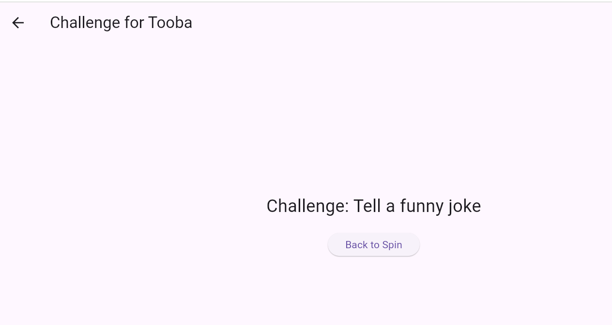
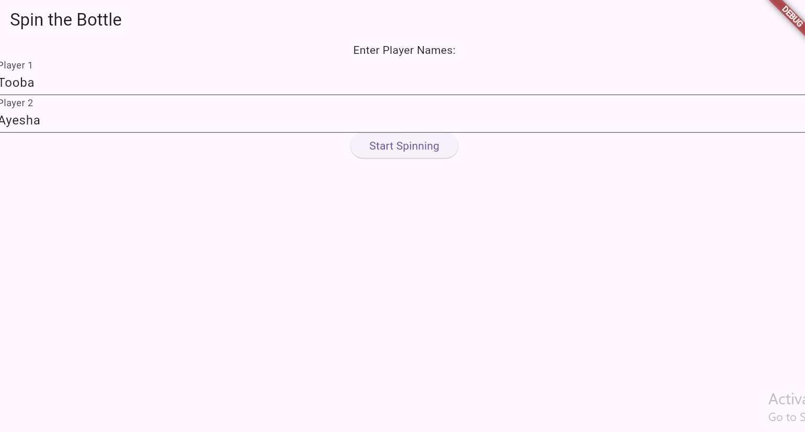
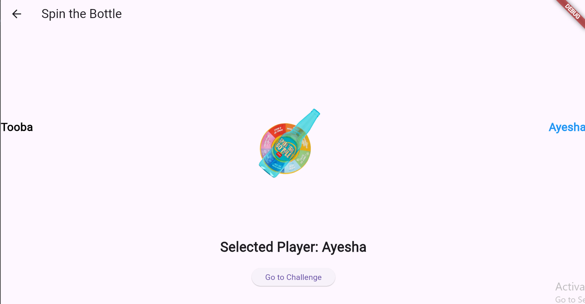

# Spin the Bottle Game

Welcome to the **Spin the Bottle** game! This classic party game is perfect for breaking the ice and having fun with friends.

## Game Overview

In **Spin the Bottle**, players take turns spinning a bottle in the center of the circle. The person at whom the bottle points when it stops spinning has to perform a challenge or answer a question. It's a great way to get everyone involved and make new memories!

## How to Play

1. Gather your friends in a circle.
2. Place a bottle in the center of the circle.
3. One player spins the bottle.
4. The person at whom the bottle points must complete a challenge or answer a question.
5. Continue taking turns until everyone has had a chance to spin!

## YouTube Video
Watch the gameplay here:

[YouTube Video Link](https://youtu.be/23s5Rd0ut6Q)

## Images

Here are some images from our Spin the Bottle game sessions:

## Conclusion

Spin the Bottle is a fun and engaging game suitable for players of all ages. Gather your friends, spin the bottle, and let the fun begin!

Enjoy the game!

